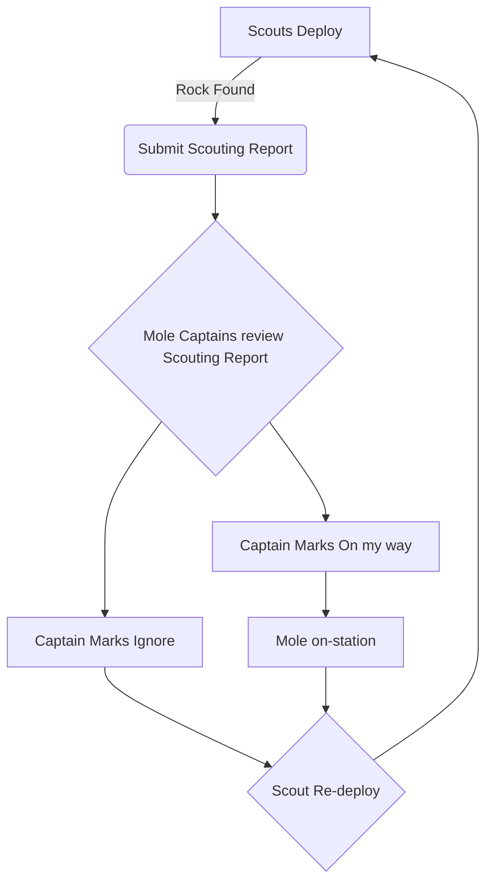

# Introduction
The following document is an outline of the current mining doctrine for the Frontier Industrial Cooperative as of game version `3.24.2`. This Doctrine specifically applies to any operations hosted by FIC. 
## Visitors
If you or your org has been invited to participate in an FIC mining event, and there is a conflict between your org's doctrine and the doctrine defined below, contact Seriphai or Detroyer to discuss accommodations needed for your participation.

# Doctrine 
## Tools used
### DCS-SRS
The Fronter uses Discord and DCS-SRS for multi-group communication. We operation on the Od3ica Relay Server that can be found [here](https://srs-citizen.app)
Mining and Logistics ships should be in their own discord channel so that crews can coordinate efforts without interfering with other crews.

Command Channel `369.369` - Captains and/or Team Leaders for each crew should be in this channel

### Regolith.Rocks
[Regolith.Rocks](https://regolith.rocks/) is a fan-made site used to record mining and salvaging sessions. Participation in a Frontier Event requires logging into Regolith and joining the active mining session.

## Profit Sharing
In the spirit of teamwork, the Frontier institutes an "all-for-all" profit sharing system. Each and every mineral mined in the participation of a Frontier Mining Event should be recorded in Regolith and the profits are distributed to all participants in the event.
#### Shares System
All participating members are assigned 4 shares of the profits from mining activities. Owners of Active Moles are afforded an additional share to offset fuel/module replacement costs. See [[#Fleet Composition]] for more information about Active Moles.
* for internal events ONLY: Team Leaders officially qualified in regolith and SRS receive an additional share as well
#### Receiving Payment
Refinement activites can take some time, up two 4 days. Payment status is recorded in Regolith and you should be able to check receipt of payment at any time. Make sure that your Regolith name is an exact match to your in-game name.
## Fleet Composition

### Basic Composition
The basic composition of a Mining Fleet in the current iteration of both Star Citizen and FIC is targeted at having at least one (1) fully crewed mole actively mining at all times. Due to game restrictions the basic "Mining Group" consists of a total manning suggestion of 8 participants:
1. One Mole Mining (Termed 'Active' Mole)
2. One Logistics Vessel with additional bags
3. One Mole running between the Logistics Vessel and refinement stations. The operator of this vessel is required to record all refinement jobs in regolith and is obligated to complete the event by collecting and selling refined material in a timely manner
4. 2 Scouts - There should be no more than 2 Scouts per mining vessel. Additional participants should be assigned to Logistics or overflow crew.
### Advanced/Inter-Org Composition
Each org represented at an event is invited and encouraged to field at minimum one Active Mole, the captain of which will receive the additional share mentioned above. Beyond one fully-crewed Mole and two scouts, additional participants are requested to "fill out" other crew-positions until which an "overflow" crew can be assembled and assigned an additional mole, the owner of which to be determined either by availability or majority of overflow crew organization. 

### Movement SOP/How we use Regolith

