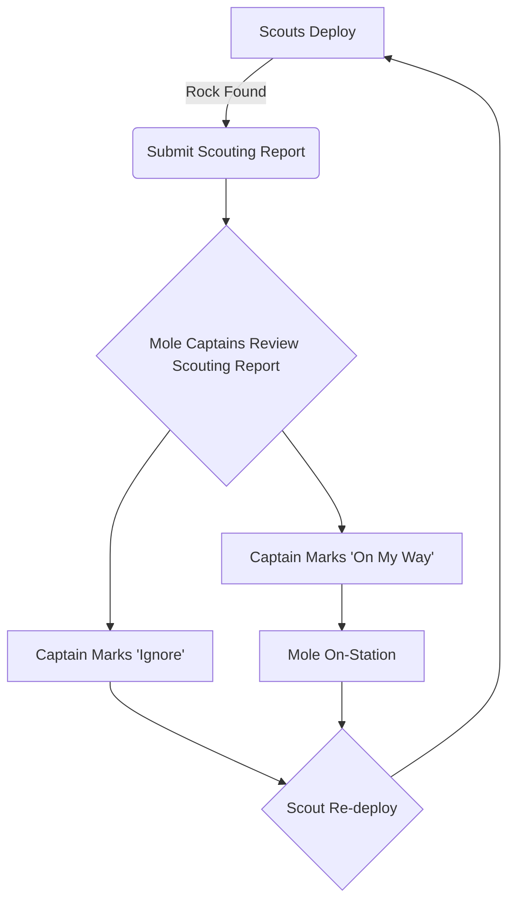

# Introduction

This document outlines the current mining doctrine for the Frontier Industrial Cooperative (FIC) as of game version `3.24.2`. This doctrine specifically governs operations hosted by FIC. 

## Guests
If you or your organization have been invited to participate in an FIC mining event and find that your organization's doctrine conflicts with the guidelines outlined below, please reach out to Seriphai or Detroyer to discuss any accommodations needed for your participation.

# Doctrine 
## Communication Tools
### DCS-SRS
FIC uses Discord and DCS-SRS to facilitate multi-group communication. Operations run on the Od3ica Relay Server, accessible [here](https://srs-citizen.app). Training for using DCS-SRS can be provided upon request. A training video is available [[DCS-SRS|Here]] 

Mining and logistics crews are advised to use dedicated Discord channels for effective team coordination without disrupting other crews. 

- **Command Channel (369.369)** - Captains and Team Leaders for each crew should connect to this channel to coordinate operations.

### Regolith.Rocks
[Regolith.Rocks](https://regolith.rocks/) is a fan-made site used to record mining and salvaging sessions. Joining an active mining session in Regolith is a requirement for participating in any Frontier Event. A small video showing our uses for Regolith is shown [[Regolith.Rocks|Here]]

## Profit Sharing
In the spirit of teamwork, FIC operates under a profit-sharing model where all minerals mined during a Frontier Mining Event are recorded in Regolith, and profits are shared equally among participants.

#### Shares System
Each participant receives four shares of the mining profits. Owners of "Active Moles" are allocated an additional share to offset fuel and module replacement costs (see [[#Fleet Composition]] for more details on Active Moles).

- **For Internal Events ONLY**: Officially qualified Team Leaders in Regolith and SRS will receive one additional share.

#### Payment Distribution
Refinement activities may take up to four days to complete. Payment statuses are updated in Regolith, allowing you to track receipt of payment at any time. Ensure your Regolith username matches your in-game name precisely.

## Fleet Composition

### Basic Fleet Structure
A standard Mining Fleet composition in Star Citizen and FIC operations aims to have at least one (1) fully crewed Mole mining continuously. Due to game limitations, the recommended "Mining Group" comprises a total of eight participants as follows:

1. One actively mining Mole (referred to as the 'Active Mole')
2. One logistics vessel with additional bags
3. One Mole shuttling between the logistics vessel and refinement stations; this operator is responsible for recording all refinement jobs in Regolith and completing the event by promptly collecting and selling the refined materials
4. Up to two scouts (no more than two scouts per mining vessel). Additional participants should support logistics or form overflow crews.

### Advanced / Multi-Org Fleet Structure
Each organization represented at an event is encouraged to deploy at least one fully-crewed Active Mole. The captain of each Active Mole is eligible for the additional share outlined above. Beyond the initial crewed Mole and two scouts, extra participants should support logistics or form "overflow" crews. Overflow crews will be assigned an additional Mole, with the ownership determined by availability or majority preference of the overflow organization.

### Movement SOP / Regolith Workflow

